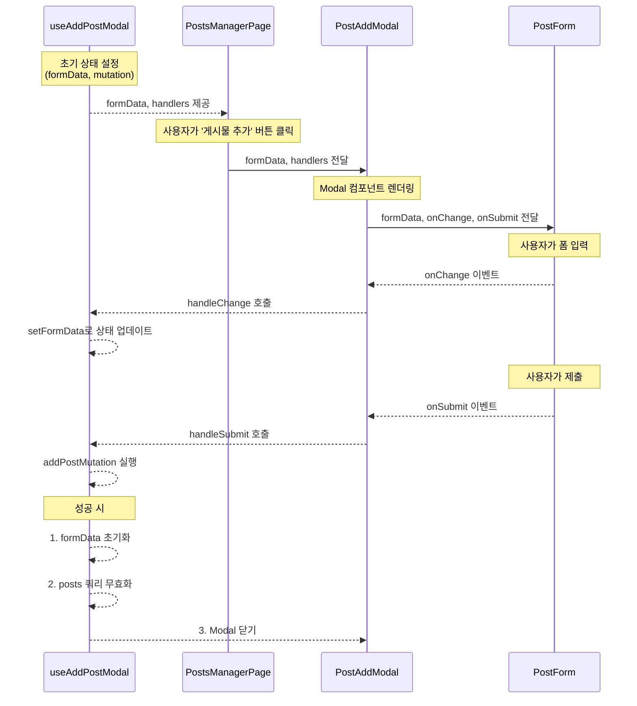
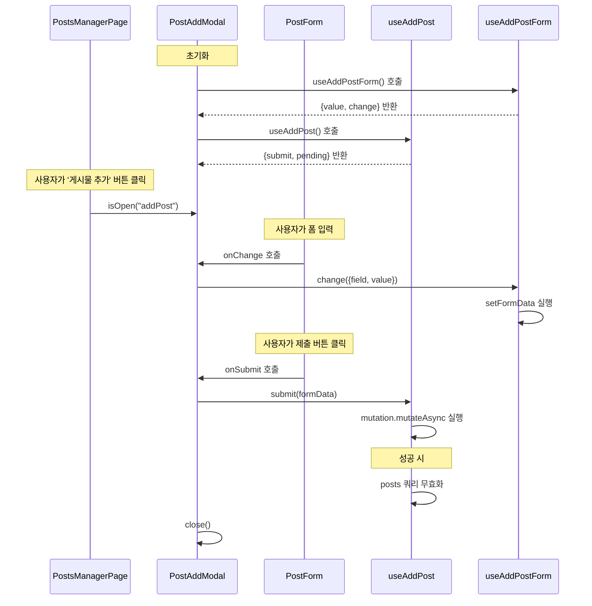
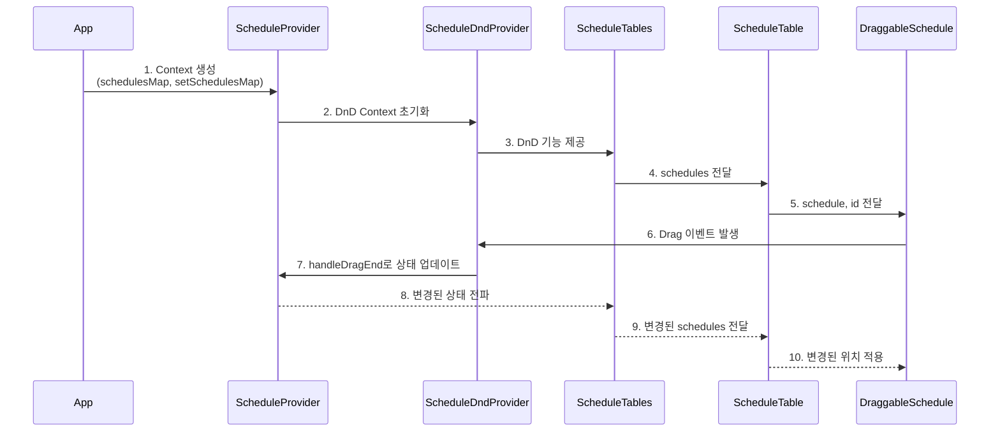
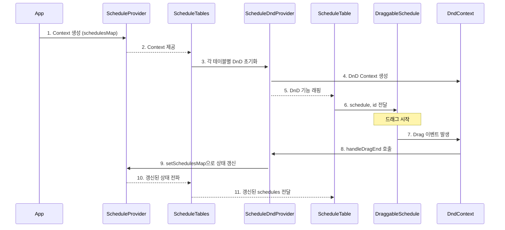
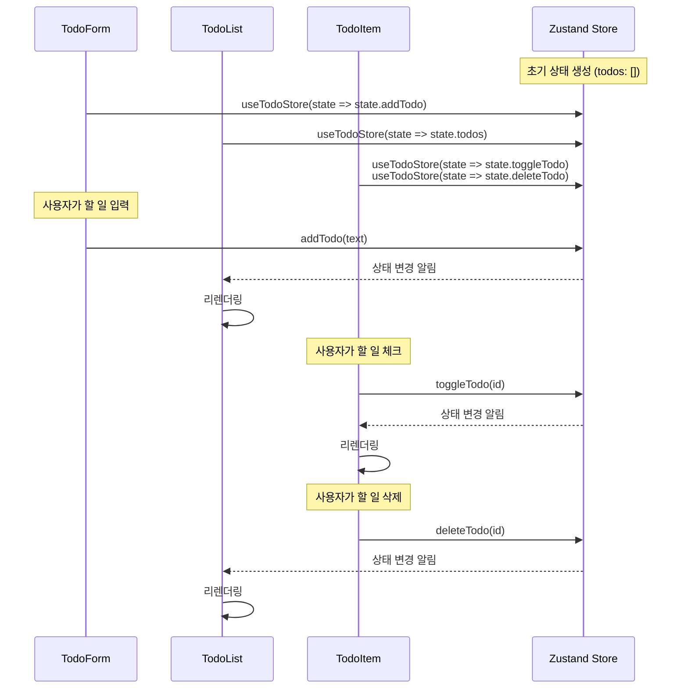

# 프론트엔드 상태관리 전략

## 1. 상태관리란 무엇일까?

### (1) 상태관리가 등장하게 된 배경

**1) 서버 중심(SSR) → 클라이언트 중심(SPA)으로 변화**

- 모바일 앱의 등장으로 웹에서도 앱과 유사한 경험 요구
- SPA 방식 도입으로 클라이언트에 유지해야 할 상태가 급증
- 페이지 새로고침 없이 다양한 UI를 처리하는 복잡성 증가

```jsx
// 복잡해진 클라이언트 상태들
let user = {
  /* 사용자 정보 */
};
let cart = [
  /* 장바구니 아이템 */
];
let uiState = { isModalOpen: false, darkMode: true };
let apiData = {
  /* API 응답 데이터 */
};
```

**2) 체계적인 상태관리 패턴과 라이브러리 등장**

- 2013년: React의 단방향 데이터 흐름 소개
- 2015년: Redux(Flux 패턴)의 등장으로 전역 상태관리 체계화
- 2018년 이후: MobX, Zustand, Recoil, Jotai 등으로 발전

**3) 상태관리 핵심 원칙 확립**

- 단일 진실 공간(Single source of truth)
- 불변성(Immutability)을 통한 예측 가능한 상태 변화
- 명시적인 상태 업데이트 메커니즘
- 클라이언트 상태와 서버 상태의 분리

**AS-IS (상태 관리 도입 전)**

```jsx
// 전역 변수로 관리되는 상태
let shoppingCart = [];
let notifications = [];

// 장바구니 기능
function addToCart(product) {
  shoppingCart.push(product);
  localStorage.setItem("cart", JSON.stringify(shoppingCart));

  // DOM 직접 조작
  const cartCount = document.getElementById("cart-count");
  cartCount.textContent = shoppingCart.length;

  // 알림 추가
  addNotification(`${product.name}이(가) 장바구니에 추가되었습니다`);
}

// 알림 기능
function addNotification(message) {
  notifications.push(message);

  // DOM 직접 생성 및 조작
  const notificationEl = document.createElement("div");
  notificationEl.className = "notification";
  notificationEl.textContent = message;

  const container = document.getElementById("notification-container");
  container.appendChild(notificationEl);

  // 3초 후 알림 제거
  setTimeout(() => {
    container.removeChild(notificationEl);
  }, 3000);
}
```

**TO-BE (현재의 모습)**

```jsx
import React, { useState, useEffect } from "react";

// 컴포넌트 내부에서 관리되는 상태
function ShoppingApp() {
  const [cart, setCart] = useState([]);
  const [notifications, setNotifications] = useState([]);

  // 장바구니 기능
  const addToCart = (product) => {
    setCart((prevCart) => [...prevCart, product]);
    addNotification(`${product.name}이(가) 장바구니에 추가되었습니다`);
  };

  // 알림 기능
  const addNotification = (message) => {
    const newNotification = { id: Date.now(), message };
    setNotifications((prev) => [...prev, newNotification]);

    // 3초 후 알림 제거
    setTimeout(() => {
      setNotifications((prev) => prev.filter((item) => item.id !== newNotification.id));
    }, 3000);
  };

  // localStorage 동기화
  useEffect(() => {
    localStorage.setItem("cart", JSON.stringify(cart));
  }, [cart]);

  return (
    <div>
      {/* 장바구니 아이콘 */}
      <div className='cart-icon'>장바구니 ({cart.length})</div>

      {/* 알림 컨테이너 */}
      <div className='notification-container'>
        {notifications.map((notification) => (
          <div key={notification.id} className='notification'>
            {notification.message}
          </div>
        ))}
      </div>
    </div>
  );
}
```

### (2) 상태관리의 등장 후 달라진 애플리케이션의 모습

**예측 가능한 데이터 흐름**

- 상태 변경이 단방향으로 흐르며 추적 가능
- 액션 → 리듀서 → 상태 업데이트 → UI 렌더링의 명확한 사이클

**컴포넌트 간 결합도 감소**

- 컴포넌트는 필요한 상태만 구독하고 렌더링에 집중
- 상태 로직과 UI 로직의 명확한 분리

**개발 도구와 디버깅 향상**

- 상태 변화 추적 및 시간 여행 디버깅 가능
- 상태 스냅샷을 통한 애플리케이션 동작 이해 용이

**대규모 애플리케이션 구조화 가능**

- 확장 가능한 패턴으로 복잡한 애플리케이션 관리
- 팀 협업 시 일관된 데이터 접근 방식 제공

### **Summary**

- 스마트 폰의 등장으로 앱 개발이 시작 됨 → 앱의 개발 비용을 낮추기 위해 “웹뷰”를 사용 → 웹에서 앱 만큼의 사용성이 필요해짐 → 점점 클라이언트의 코드가 복잡해지고, 스마프폰의 작은 화면에 모든 내용을 담을 수 없음 → 성능도 챙기면서 유지보수도 쉬운 방법이 필요 → 상태를 기반으로 렌더링하는 시스템(선언형 방식)이 등장하고, 컴포넌트 단위 개발이 가능해짐
  - 규모가 커질수록 상태관리에 대한 복잡도가 증가하고, 이를 정돈할 수 있는 기술과 방법론이 필요해짐 → Redux 같은 상태관리 라이브러리가 등장하고 점점 발전

## 2. 상태관리를 위한 도구

### (1) 컴포넌트 로컬 상태관리

**React의 내장 상태관리 도구**

**1) useState**

- 간단한 상태 관리를 위한 가장 기본적인 Hook
- 독립적인 상태 변수를 생성하고 관리

```jsx
function Counter() {
  const [count, setCount] = useState(0);

  return (
    <div>
      <p>현재 카운트: {count}</p>
      <button onClick={() => setCount(count + 1)}>증가</button>
    </div>
  );
}
```

**2) useReducer**

- 복잡한 상태 로직을 reducer 함수로 분리
- 여러 하위 값을 포함하는 복잡한 상태 관리에 적합

```jsx
function counterReducer(state, action) {
  switch (action.type) {
    case "increment":
      return { count: state.count + 1 };
    case "decrement":
      return { count: state.count - 1 };
    default:
      throw new Error("Unknown action");
  }
}

function Counter() {
  const [state, dispatch] = useReducer(counterReducer, { count: 0 });

  return (
    <div>
      <p>현재 카운트: {state.count}</p>
      <button onClick={() => dispatch({ type: "increment" })}>증가</button>
      <button onClick={() => dispatch({ type: "decrement" })}>감소</button>
    </div>
  );
}
```

### (2) 컴포넌트 간 상태 공유

**1) Props와 리프팅 스테이트 업(Lifting State Up)**

- 부모 컴포넌트에서 상태를 관리하고 자식에게 전달
- 간단한 구조에서 효과적이지만 props drilling 문제 발생 가능

```jsx
function Parent() {
  const [count, setCount] = useState(0);

  return (
    <div>
      <Child count={count} onIncrement={() => setCount(count + 1)} />
    </div>
  );
}

function Child({ count, onIncrement }) {
  return (
    <div>
      <p>카운트: {count}</p>
      <button onClick={onIncrement}>증가</button>
    </div>
  );
}
```

**2) Context API**

- React의 내장 기능으로 컴포넌트 트리 전체에 데이터 제공
- props drilling 없이 여러 컴포넌트에서 데이터 접근 가능

```jsx
// Context 생성
const CountContext = createContext();

// Provider 컴포넌트
function CountProvider({ children }) {
  const [count, setCount] = useState(0);

  return <CountContext.Provider value={{ count, setCount }}>{children}</CountContext.Provider>;
}

// Consumer 컴포넌트
function Counter() {
  const { count, setCount } = useContext(CountContext);

  return (
    <div>
      <p>카운트: {count}</p>
      <button onClick={() => setCount(count + 1)}>증가</button>
    </div>
  );
}

// 사용
function App() {
  return (
    <CountProvider>
      <div>
        <h1>카운터 앱</h1>
        <Counter />
        {/* 다른 컴포넌트들도 동일한 상태에 접근 가능 */}
      </div>
    </CountProvider>
  );
}
```

### (3) 전역 상태관리 라이브러리

**1) Redux**

- Flux 패턴 기반의 상태관리 라이브러리
- 단일 스토어, 불변성, 순수 함수 리듀서가 핵심 원칙

```jsx
// 액션 타입 정의
const INCREMENT = "INCREMENT";

// 액션 생성자
const increment = () => ({ type: INCREMENT });

// 리듀서
const counterReducer = (state = { count: 0 }, action) => {
  switch (action.type) {
    case INCREMENT:
      return { ...state, count: state.count + 1 };
    default:
      return state;
  }
};

// 스토어 생성
const store = createStore(counterReducer);

// 리액트와 연결
function Counter() {
  const count = useSelector((state) => state.count);
  const dispatch = useDispatch();

  return (
    <div>
      <p>카운트: {count}</p>
      <button onClick={() => dispatch(increment())}>증가</button>
    </div>
  );
}
```

**2) Zustand**

- 훅 기반의 간결한 상태관리 라이브러리
- Redux보다 적은 보일러플레이트 코드

```jsx
import create from "zustand";

// 스토어 생성
const useCountStore = create((set) => ({
  count: 0,
  increment: () => set((state) => ({ count: state.count + 1 })),
  decrement: () => set((state) => ({ count: state.count - 1 })),
}));

// 컴포넌트에서 사용
function Counter() {
  const { count, increment, decrement } = useCountStore();

  return (
    <div>
      <p>카운트: {count}</p>
      <button onClick={increment}>증가</button>
      <button onClick={decrement}>감소</button>
    </div>
  );
}
```

**3) Jotai**

- 원자(atom) 기반 상태관리 라이브러리
- 작은 단위의 상태를 조합하여 사용

```jsx
import { atom, useAtom } from "jotai";

// 기본 atom 생성
const countAtom = atom(0);

// 파생 atom
const doubleCountAtom = atom((get) => get(countAtom) * 2);

function Counter() {
  const [count, setCount] = useAtom(countAtom);
  const [doubleCount] = useAtom(doubleCountAtom);

  return (
    <div>
      <p>카운트: {count}</p>
      <p>2배 카운트: {doubleCount}</p>
      <button onClick={() => setCount((c) => c + 1)}>증가</button>
    </div>
  );
}
```

**4) MobX**

- 객체 지향적 접근 방식의 상태관리 라이브러리
- 관찰 가능한(observable) 상태와 자동 반응(reaction)이 특징

```jsx
import { makeObservable, observable, action, computed } from "mobx";
import { observer } from "mobx-react-lite";

// 상태 스토어 정의
class CounterStore {
  count = 0;

  constructor() {
    makeObservable(this, {
      count: observable,
      increment: action,
      decrement: action,
      doubleCount: computed,
    });
  }

  increment() {
    this.count += 1;
  }

  decrement() {
    this.count -= 1;
  }

  get doubleCount() {
    return this.count * 2;
  }
}

// 스토어 인스턴스 생성
const counterStore = new CounterStore();

// observer HOC로 컴포넌트 감싸기
const Counter = observer(() => {
  return (
    <div>
      <p>카운트: {counterStore.count}</p>
      <p>2배 카운트: {counterStore.doubleCount}</p>
      <button onClick={() => counterStore.increment()}>증가</button>
      <button onClick={() => counterStore.decrement()}>감소</button>
    </div>
  );
});
```

- 불변성보다 가변성 채택(mutable state)
- 반응형 프로그래밍 패러다임 기반
- 상태 변화를 자동으로 추적하고 UI 업데이트
- Redux보다 적은 보일러플레이트 코드
- 객체 지향 프로그래밍 스타일에 적합

### (4) 서버 상태 관리 도구

**1) TanStack Query**

- 서버 데이터 가져오기, 캐싱, 동기화를 위한 라이브러리
- 자동 리프레시, 데이터 무효화, 페이지네이션 지원

```jsx
import { useQuery, useMutation, queryClient } from "react-query";

// 데이터 조회
function Products() {
  const { data, isLoading, error } = useQuery("products", fetchProducts);

  if (isLoading) return <div>로딩 중...</div>;
  if (error) return <div>에러: {error.message}</div>;

  return (
    <div>
      {data.map((product) => (
        <div key={product.id}>{product.name}</div>
      ))}
    </div>
  );
}

// 데이터 변경
function AddProduct() {
  const mutation = useMutation(addProduct, {
    onSuccess: () => {
      queryClient.invalidateQueries("products");
    },
  });

  return (
    <button onClick={() => mutation.mutate({ name: "새 제품" })} disabled={mutation.isLoading}>
      제품 추가
    </button>
  );
}
```

**2) SWR (Stale-While-Revalidate)**

- Vercel에서 개발한 데이터 가져오기 라이브러리
- 캐시된 데이터를 먼저 보여주고 백그라운드에서 갱신

```jsx
import useSWR from "swr";

function Profile() {
  const { data, error, isLoading } = useSWR("/api/user", fetcher);

  if (isLoading) return <div>로딩 중...</div>;
  if (error) return <div>에러가 발생했습니다</div>;

  return <div>안녕하세요, {data.name}님!</div>;
}
```

이러한 상태관리 도구들은 각기 다른 사용 사례와 복잡성에 맞게 설계되었습니다. 어떤 도구를 선택할지는 애플리케이션의 규모, 팀의 선호도, 성능 요구사항 등에 따라 달라집니다.

### Summary

| **라이브러리**           | **특징**                        | **장점**                | **단점** | **성능 최적화 방법** |
| ------------------------ | ------------------------------- | ----------------------- | -------- | -------------------- |
| **Context API**          | 컴포넌트 트리 전체 데이터 공유  | • props drilling 방지   |
| • React 내장 기능        | • 소비자 컴포넌트 전체 리렌더링 |
| • 깊은 중첩 시 성능 이슈 | • Context 분리                  |
| • memo 활용              |
| **Redux**                | 단일 스토어, Flux 패턴          | • 예측 가능한 상태 변화 |

• 강력한 개발자 도구
• 풍부한 미들웨어 | • 많은 보일러플레이트
• 복잡한 설정 | • 선택적 구독
• reselect
• immer |
| **Zustand** | 간결한 API, 훅 기반 | • 최소 보일러플레이트
• 쉬운 통합 | • 제한된 개발자 도구
• 대규모 앱에 제한적 | • 선택적 상태 구독
• 상태 분리 |
| **Jotai** | 원자 기반, 상향식 접근 | • 세분화된 리렌더링
• 조합 가능한 API | • 복잡한 상태 관계 관리 어려움 | • 최소한의 atom 구독
• atom 분리 |
| **React Query** | 서버 데이터 특화 | • 자동 리프레시
• 내장된 오류 처리
• 페이지네이션 | • 클라이언트 상태에 오버헤드 | • 쿼리 키 설계
• 캐시 무효화 정책 |

## 3. 코드를 통해 살펴보기

### (1) useState: Modal로 입력폼을 관리하는 사례

```tsx
export const PostsManagerPage = () => {
  const { onOpen } = useToggleState<ToggleKey>()
  const postAddModalProps = useAddPostModal();

	return (
		<Card className="w-full max-w-6xl mx-auto">
      <CardHeader>
        <CardTitle className="flex items-center justify-between">
          <span>게시물 관리자</span>
          <Button onClick={() => onOpen("addPost")}>
            <Plus className="w-4 h-4 mr-2" />
            게시물 추가
          </Button>
        </CardTitle>
      </CardHeader>
      <CardContent ... />

			<PostAddModal {...postAddModalProps} />

      <PostEditModal
        post={editingPost}
        onChange={handleEditChange}
        onSubmit={submitEditPost}
        isSubmitting={isEditSubmitting}
      />
    </Card>
	)
}
```

```tsx
export const useAddPostModal = () => {
  const { onClose } = useToggleState<ToggleKey>();
  const [formData, setFormData] = useState({ title: "", body: "", userId: 1 });

  const addPostMutation = useMutation({
    ...postMutations.addMutation(),
    onSuccess: () => {
      setFormData({ title: "", body: "", userId: 1 });
      queryClient.invalidateQueries({ queryKey: ["posts"] });

      handleClose();
    },
    onError: (error) => {
      console.error("게시물 추가 오류:", error);
    },
  });

  const handleChange = ({ field, value }: { field: string; value: string | number }) => {
    setFormData((prev) => ({ ...prev, [field]: value }));
  };

  const handleSubmit = () => {
    addPostMutation.mutateAsync(formData);
  };

  const handleClose = () => {
    setFormData({ title: "", body: "", userId: 1 });
    onClose("addPost");
  };

  return {
    formData,
    onChange,
    onSubmit,
    pending: addPostMutation.isPending,
  };
};
```

```tsx
interface PostAddModalProps {
  formData: {
    title: string;
    body: string;
    userId: number;
  };
  onChange: (data: { field: string; value: string | number }) => void;
  onSubmit: () => void;
  pending: boolean;
}

export const PostAddModal = ({ formData, onChange, onSubmit, pending }: PostAddModalProps) => {
  const { isOpen, onClose } = useToggleState<ToggleKey>();
  return (
    <Modal open={isOpen("addPost")} onClose={() => onClose("addPost")} title='새 게시물 추가'>
      <PostForm
        formData={formData}
        onChange={(field, value) => onChange({ field, value })}
        submitLabel={{ default: "게시물 추가", loading: "추가 중..." }}
        onSubmit={onSubmit}
        pending={pending}
      />
    </Modal>
  );
};
```



1. useAddPostModal이 로컬 상태(useState)로 값이 관리되고 있습니다.
2. useAddPostModal에서 setState가 발생하면 PostsManagerPage이 렌더링 됩니다.
3. PostsManagerPage의 경우 여러 개의 Modal과 게시물 목록을 포함하여 수백 개의 컴포넌트를 렌더링하고 있습니다.
4. 결과적으로 PostManagerPage에서 렌더링이 발생 → 자식 컴포넌트에게 전파 되면서, 1회 입력당 60ms 이상의 렌더링 비용이 발생합니다.

이를 개선하기 위해선 다음과 같은 과정이 필요합니다.

1. PostForm 내부에 useState로 form의 상태를 정의하고, change 시점에 반영합니다.
2. PostForm에서 submit을 하는 경우 PostManagerPage에 알립니다.

```tsx
// Page에서는 PostAddModal에 대한 관심사 제거
export const PostsManagerPage = () => {
  const { onOpen } = useToggleState<ToggleKey>()

	return (
		<Card className="w-full max-w-6xl mx-auto">
      <CardHeader>
        <CardTitle className="flex items-center justify-between">
          <span>게시물 관리자</span>
          <Button onClick={() => onOpen("addPost")}>
            <Plus className="w-4 h-4 mr-2" />
            게시물 추가
          </Button>
        </CardTitle>
      </CardHeader>
      <CardContent ... />

			<PostAddModal />

      <PostEditModal
        post={editingPost}
        onChange={handleEditChange}
        onSubmit={submitEditPost}
        isSubmitting={isEditSubmitting}
      />
    </Card>
	)
}
```

```tsx
// AddPost에 대한 API 요청을 하나의 묶어서 관리
export const useAddPost = () => {
  const addPostMutation = useMutation({
    ...postMutations.addMutation(),
    onSuccess: () => {
      queryClient.invalidateQueries({ queryKey: ["posts"] });
    },
    onError: (error) => {
      console.error("게시물 추가 오류:", error);
    },
  });

  return {
    submit: addPostMutation.mutateAsync,
    pending: addPostMutation.isPending,
  };
};

// formData에 대한 관심사를 하나로 묶어서 관리
export const useAddPostForm = () => {
  const [formData, setFormData] = useState({ title: "", body: "", userId: 1 });

  const changeFormData = ({ field, value }: { field: string; value: string | number }) => {
    setFormData((prev) => ({ ...prev, [field]: value }));
  };

  return {
    value: formData,
    change: changeFormData,
  };
};
```

```tsx
// PostAddModal이 자신의 상태를 스스로 책임지도록 함
export const PostAddModal = () => {
  const { isOpen, onClose } = useToggleState<ToggleKey>();

  const formData = useAddPostForm();
  const addPost = useAddPost();
  const opened = isOpen("addPost");
  const close = () => onClose("addPost");

  const handleSubmit = () => {
    addPost.submit(formData.value);
    close();
  };

  return (
    <Modal open={opened} onClose={close} title='새 게시물 추가'>
      <PostForm
        formData={formData.value}
        onChange={(field, value) => formData.change({ field, value })}
        submitLabel={{
          default: "게시물 추가",
          loading: "추가 중...",
        }}
        onSubmit={handleSubmit}
        pending={addPost.pending}
      />
    </Modal>
  );
};
```

AS-IS: input에 입력할 때 70ms 정도 시간 소요

TO-BE: input에 입력할 때 **3ms 정도의 시간** 소요



1. PostAddModal 내부로 formData의 state 옮겼습니다.
2. PostAddModal 내부에서 상태 변화가 발생해도 PostsManagerPage까지 전파되지 않습니다.
3. PostAddModal의 관심사를 PostAddModal 스스로 관리하도록 만들었습니다.

### (2) Context/Provider: with Drag&Drop 기반의 시간표 관리 프로그램

```jsx
function App() {
  return (
    <ChakraProvider>
      <ScheduleProvider>
        <ScheduleDndProvider>
          <ScheduleTables />
        </ScheduleDndProvider>
      </ScheduleProvider>
    </ChakraProvider>
  );
}
```

```jsx
export const useScheduleContext = () => {
  const context = useContext(ScheduleContext);
  if (context === undefined) {
    throw new Error("useSchedule must be used within a ScheduleProvider");
  }
  return context;
};

export const ScheduleProvider = ({ children }) => {
  const [schedulesMap, setSchedulesMap] = useState({});
  const contextValue = { schedulesMap, setSchedulesMap };

  return <ScheduleContext.Provider value={contextValue}>{children}</ScheduleContext.Provider>;
};
```

```jsx
export default function ScheduleDndProvider({ children }: PropsWithChildren) {
  const { schedulesMap, setSchedulesMap } = useScheduleContext();
  const sensors = useSensors(
    useSensor(PointerSensor, {
      activationConstraint: {
        distance: 8,
      },
    })
  );

  const handleDragEnd = (event: any) => {
    /* ...요약.... */
  };

  return (
    <DndContext sensors={sensors} onDragEnd={handleDragEnd} modifiers={modifiers}>
      {children}
    </DndContext>
  );
}
```

```jsx
const ScheduleTable = ({ tableId, schedules, onScheduleTimeClick, onDeleteButtonClick }: Props) => {

	...

  const dndContext = useDndContext();
  const activeTableId = (() => {
    const activeId = dndContext.active?.id;
    return activeId ? String(activeId).split(":")[0] : null;
  })();

  return (
    <Box
      outline={activeTableId === tableId ? "5px dashed" : undefined}
    >
      <Grid ...></Grid>

      {schedules.map((schedule, index) => (
        <DraggableSchedule ... />
      ))}
    </Box>
  );
};
```



1. 최상위 레이어에 Schedule 값을 관리하기 위한 Context를 정의했습니다.
2. ScheduleTable에 렌더링된 시간표 개체를 드래그할 수 있습니다.
3. ScheduleTable의 개체 하나를 드래그 하면 Drag/Drop 정보를 관리하는 Context에 접근하고, 개체를 움직시작하면 ScheduleContext와 DragContext에 각각 값이 업데이트 됩니다.
4. ScheduleTable 한 개당 최소 24개의 컴포넌트 (네모 상자 묶음)를 가지고 있고, 전부 Context를 가져다 사용하고 있습니다.
5. 드래그를 한 번 할 때 마다 모든 시간표 컴포넌트에 렌더링이 전파됩니다.
6. 1회 드래그를 할 때 마다 200ms 이상의 렌더링 비용이 소모되고, 보통 드래그 기반의 인터랙션은 수십 회의 렌더링을 필요로 합니다.
7. 결국 현재와 같은 시스텡믄 사용자가 어플리케이션을 사용하기 불가능한 수준의 상태가 됩니다.

여기서 핵심은 Context의 관리방법입니다. Context의 값이 변경될 때, Context를 의존하는 모든 컴포넌트에 영향이 갑니다. 이를 최소화 하기 위해선 **Context를 작은 단위로 만들어서 관리**해야 합니다.

먼저 drag가 다른 ScheduleTable로 전파되지 않도록 하는 방법입니다.

```jsx
function App() {
  return (
    <ChakraProvider>
      <ScheduleProvider>
        <ScheduleTables />
      </ScheduleProvider>
    </ChakraProvider>
  );
}
```

```jsx
function ScheduleTables() {
  const { schedulesMap, setSchedulesMap } = useScheduleContext();
  return (
    <Flex w="full" gap={6} p={6} flexWrap="wrap">
      {Object.entries(schedulesMap).map(([tableId, schedules], index) => (
        <Stack key={tableId} width="600px">
          <Flex ... />
          <ScheduleDndProvider>
            <ScheduleTable ... />
          </ScheduleDndProvider>
        </Stack>
      ))}
    </Flex>
  )
}
```

ScheduleDndProvider를 최상위 레이어에 씌워놓는게 아니라, 각각의 ScheduleTable에 씌워서 관리하도록 합니다.

ScheduleTable에서 Drag/Drop을 하더라도 다른 스케쥴로 전파되지 않도록 만들 수 있습니다.



이를 통해 알 수 있는 부분은, 인터랙션이 빈번하게 발생하는 환경에서 컨텍스트를 전역상태로 만들어서 관리하는 경우 컨텍스트의 변화가 전역에 전파되고 불필요한 렌더링이 많이 발생한다는 것입니다.

그래서 컨텍스트는 작은 단위로 만들어서 관리해야 하고, 꼭 필요한 곳에서만 사용하도록 만들어야 불필요한 렌더링을 예방할 수 있습니다.

```jsx
function AppContextProvider({ children }) {
  const [theme, setTheme] = useState("light");
  const [items, setItems] = useState(generateItems(1000));
  const [user, setUser] = useState(null);
  const [notifications, setNotifications] = useState([]);

  const toggleTheme = () => {
    setTheme((prevTheme) => (prevTheme === "light" ? "dark" : "light"));
  };

  const addItems = () => {
    setItems((prevItems) => [...prevItems, ...generateItems(1000, prevItems.length)]);
  };

  const login = (email: string) => {
    setUser({ id: 1, name: "홍길동", email });
    addNotification("성공적으로 로그인되었습니다", "success");
  };

  const logout = () => {
    setUser(null);
    addNotification("로그아웃되었습니다", "info");
  };

  const addNotification = (message, type) => {
    const newNotification: Notification = {
      id: Date.now(),
      message,
      type,
    };
    setNotifications((prev) => [...prev, newNotification]);
  };

  const removeNotification = (id) => {
    setNotifications((prev) => prev.filter((notification) => notification.id !== id));
  };

  const contextValue = {
    theme,
    toggleTheme,
    user,
    login,
    logout,
    notifications,
    addNotification,
    removeNotification,
  };

  return <AppContext.Provider value={contextValue}>{chidlren}</AppContext.Provider>;
}
```

- 테마, 사용자 데이터, 알림 등의 관심사가 뭉쳐져셔 관리되는 모습
- 테마를 의존하는 컴포넌트 A가 있을 때, 사용자 데이터가 변경되어도 컴포넌트 A가 렌더링 됨

```jsx
function AppContextProvider({ children }) {
  const [theme, setTheme] = useState("light");
  const [user, setUser] = useState<User | null>(null);
  const [notifications, setNotifications] = useState<Notification[]>([]);
  const [items, setItems] = useState(() => generateItems(1000));

  const addItems = useCallback(() => {
    setItems((prevItems) => [
      ...prevItems,
      ...generateItems(1000, prevItems.length),
    ]);
  }, []);

  const toggleTheme = useCallback(() => {
    setTheme((prevTheme) => (prevTheme === "light" ? "dark" : "light"));
  }, []);

  const login = useCallback((email: string) => {
    setUser({ id: 1, name: "홍길동", email });
    addNotification("성공적으로 로그인되었습니다", "success");
  }, []);

  const logout = useCallback(() => {
    setUser(null);
    addNotification("로그아웃되었습니다", "info");
  }, []);

  const addNotification = useCallback(
    (message: string, type: Notification["type"]) => {
      const newNotification: Notification = {
        id: Date.now(),
        message,
        type,
      };
      setNotifications((prev) => [...prev, newNotification]);
    },
    [],
  );

  const removeNotification = useCallback((id: number) => {
    setNotifications((prev) =>
      prev.filter((notification) => notification.id !== id),
    );
  }, []);

  const themeContextValue = useMemo(
    () => ({ theme, toggleTheme }),
    [theme, toggleTheme],
  );

  const userContextValue = useMemo(
    () => ({ user, login, logout }),
    [user, login, logout],
  );

  const notificationContextValue = useMemo(
    () => ({
      notifications,
      addNotification,
      removeNotification,
    }),
    [notifications, addNotification, removeNotification],
  );

  return (
    <ThemeContext.Provider value={themeContextValue}>
      <UserContext.Provider value={userContextValue}>
        <NotificationContext.Provider value={notificationContextValue}>
          {children}
        </NotificationContext.Provider>
      </UserContext.Provider>
    </ThemeContext.Provider>
  )
}
```

- 관심사 단위로 컨텍스트를 분리하도록 하여 불필요한 렌더링을 방지하고, 코드에 대한 응집도를 높일 수 있습니다.

```jsx
function AppContextProvider({ children }) {
  const themeContextValue = useThemeUseCase();
  const userContextValue = useUserUseCase();
  const notificationContextValue = useNotificationUseCase();

  return (
    <ThemeContext.Provider value={themeContextValue}>
      <UserContext.Provider value={userContextValue}>
        <NotificationContext.Provider value={notificationContextValue}>
          {children}
        </NotificationContext.Provider>
      </UserContext.Provider>
    </ThemeContext.Provider>
  );
}

const useUserContext = () => useContext(UserContext);
const useThemeContext = () => useContext(ThemeContext);
const useNotificationContext = () => useContext(NotificationContext);
```

- 분할된 컨텍스트 로직을 훅으로 묶어주는 모습

### (3) Zustand: TodoList를 통해 알아보기

이번에는 요구사항의 변화와 코드의 변화를 유심히 지켜봐주세요.

**<할 일 관리 요구사항>**

1. 사용자는 새로운 할 일을 추가할 수 있어야 함
2. 사용자는 할 일을 완료 상태로 표시할 수 있어야 함
3. 사용자는 할 일을 삭제할 수 있어야 함
4. 사용자는 모든 할 일 목록을 볼 수 있어야 함

```tsx
export interface Todo {
  id: string;
  text: string;
  completed: boolean;
}

interface TodoState {
  todos: Todo[];
  addTodo: (text: string) => void;
  toggleTodo: (id: string) => void;
  deleteTodo: (id: string) => void;
}

export const useTodoStore = create<TodoState>()(
  persist(
    (set) => ({
      todos: [],
      addTodo: (text) =>
        set((state) => ({
          todos: [...state.todos, { id: crypto.randomUUID(), text, completed: false }],
        })),
      toggleTodo: (id) =>
        set((state) => ({
          todos: state.todos.map((todo) =>
            todo.id === id ? { ...todo, completed: !todo.completed } : todo
          ),
        })),
      deleteTodo: (id) =>
        set((state) => ({
          todos: state.todos.filter((todo) => todo.id !== id),
        })),
    }),
    {
      name: "todo-storage",
    }
  )
);
```

TodoStore 내부에서 todos 값과 todos를 변경시키는 함수가 응집되어있습니다.

```tsx
export function TodoForm() {
  const [text, setText] = useState("");
  const addTodo = useTodoStore((state) => state.addTodo);

  const handleSubmit = (e: React.FormEvent) => {
    e.preventDefault();
    if (text.trim()) {
      addTodo(text);
      setText("");
    }
  };

  return (
    <form onSubmit={handleSubmit} className='flex gap-2 mb-6'>
      <Input
        type='text'
        value={text}
        onChange={(e) => setText(e.target.value)}
        placeholder='새로운 할 일을 입력하세요'
        className='flex-1'
      />
      <Button type='submit' size='icon'>
        <Plus className='h-4 w-4' />
        <span className='sr-only'>할 일 추가</span>
      </Button>
    </form>
  );
}
```

- TodoForm에서는 addTodo를 가져와서 사용합니다.

```tsx
export function TodoList() {
  const todos = useTodoStore((state) => state.todos);

  if (todos.length === 0) {
    return (
      <div className='text-center py-6 text-gray-500'>
        할 일이 없습니다. 새로운 할 일을 추가해보세요!
      </div>
    );
  }

  return (
    <ul className='space-y-2'>
      {todos.map((todo) => (
        <TodoItem key={todo.id} todo={todo} />
      ))}
    </ul>
  );
}

function TodoItem({ todo }: { todo: Todo }) {
  const toggleTodo = useTodoStore((state) => state.toggleTodo);
  const deleteTodo = useTodoStore((state) => state.deleteTodo);

  return (
    <li className='flex items-center justify-between p-3 bg-gray-50 rounded-lg'>
      <div className='flex items-center gap-3'>
        <Checkbox
          id={`todo-${todo.id}`}
          checked={todo.completed}
          onCheckedChange={() => toggleTodo(todo.id)}
        />
        <label
          htmlFor={`todo-${todo.id}`}
          className={`text-sm ${todo.completed ? "line-through text-gray-400" : "text-gray-700"}`}
        >
          {todo.text}
        </label>
      </div>
      <Button
        variant='ghost'
        size='icon'
        onClick={() => deleteTodo(todo.id)}
        className='h-8 w-8 text-gray-500 hover:text-red-500'
      >
        <Trash2 className='h-4 w-4' />
        <span className='sr-only'>삭제</span>
      </Button>
    </li>
  );
}
```

- TodoList와 TodoItem에서는 todos를 가져와서 사용합니다.



현재는 큰 무리 없이 상태를 관리할 수 있어보입니다. 그런데 여기에 요구사항이 이렇게 추가되면 어떻게 될까요?

**<추가된 요구사항>**

1. 다른 사용자의 할 일 목록을 조회할 수 있습니다.
2. 할 일 목록이 한 화면에서 보여져야 합니다.

간단하게 접근해보자면, Store에서 중첩된 배열로 TodoList를 관리하는 방법이 있습니다.

```jsx
export interface TodoList {
  id: string
  userId: string
  userName: string
  todos: Todo[]
}

interface TodoState {
  todoLists: TodoList[]
  addTodo: (listId: string, text: string) => void
  toggleTodo: (listId: string, todoId: string) => void
  deleteTodo: (listId: string, todoId: string) => void
}

export const useTodoStore = create<TodoState>()(
  (set) => ({
    todoLists: [
      { id: listId1, userId: "user1", userName: "유저 A", todos: [] },
      { id: listId2, userId: "user2", userName: "유저 B", todos: [] },
      { id: listId3, userId: "user3", userName: "유저 C", todos: [] },
      { id: listId4, userId: "user4", userName: "유저 D", todos: [] },
      { id: listId5, userId: "user5", userName: "유저 E", todos: [] },
      { id: listId6, userId: "user6", userName: "유저 F", todos: [] },
    ],
    addTodo: (listId, text) =>
      set((state) => ({
        todoLists: state.todoLists.map((list) =>
          list.id === listId
            ? {
              ...list,
              todos: [...list.todos, { id: crypto.randomUUID(), text, completed: false }],
            }
            : list,
        ),
      })),
    toggleTodo: (listId, todoId) =>
      set((state) => ({
        todoLists: state.todoLists.map((list) =>
          list.id === listId
            ? {
              ...list,
              todos: list.todos.map((todo) =>
                todo.id === todoId ? { ...todo, completed: !todo.completed } : todo,
              ),
            }
            : list,
        ),
      })),
    deleteTodo: (listId, todoId) =>
      set((state) => ({
        todoLists: state.todoLists.map((list) =>
          list.id === listId
            ? {
              ...list,
              todos: list.todos.filter((todo) => todo.id !== todoId),
            }
            : list,
        ),
      })),
  }),
)
```

```jsx
function App() {
  const { todoLists } = useTodoStore();

  return (
    <div className='min-h-screen bg-gray-50 py-8'>
      <div className='container mx-auto px-4 max-w-6xl text-center'>
        <h1 className='text-3xl font-bold text-gray-800 mb-8 text-center'>
          다중 사용자 할 일 목록
        </h1>
        <div className='inline-block'>
          <div className='flex gap-4 flex-wrap'>
            {todoLists.map((todoList) => (
              <TodoList key={todoList.id} todoList={todoList} />
            ))}
          </div>
        </div>
      </div>
    </div>
  );
}

export function TodoList({ todoList }: TodoListProps) {
  const { id, userName, todos } = todoList;

  return (
    <div
      className='bg-white rounded-xl shadow-md overflow-hidden'
      style={{ width: "calc(100% / 3 - 1rem)" }}
    >
      <div className='p-6'>
        <h2 className='text-xl font-bold text-gray-800 mb-4'>{userName}의 할 일 목록</h2>
        <TodoForm listId={id} />
        {todos.length === 0 ? (
          <div className='text-center py-6 text-gray-500'>
            할 일이 없습니다. 새로운 할 일을 추가해보세요!
          </div>
        ) : (
          <ul className='space-y-2'>
            {todos.map((todo) => (
              <TodoItem key={todo.id} listId={id} todo={todo} />
            ))}
          </ul>
        )}
      </div>
    </div>
  );
}
```

어느 정도 요구사항은 만족했습니다. 다만 상태의 덩어리가 너무 크고, 각각의 컴포넌트에 이게 계속 전파되는 모습입니다.

이 문제를 해결하기 위해선 다음과 같은 접근이 필요합니다.

1. 전역 상태를 **정규화(normalized)**된 상태로 관리하여 각 사용자의 할일 목록을 O(1) 의 비용으로 가져올 수 있도록 합니다.

   ```jsx
   const createdDummyTodos = () => Array.from({ length: 5 }).map((_, index) => ({
     id: crypto.randomUUID(),
     text: `할 일 ${index + 1}`,
     completed: false
   }))

   export const useTodoStore = create<TodoState>()(
     (set, get) => ({
       todosUserMap: {
         listId1: { id: "listId1", userId: "user1", userName: "유저 A", todos: [] },
         listId2: { id: "listId2", userId: "user2", userName: "유저 B", todos: createdDummyTodos() },
         listId3: { id: "listId3", userId: "user3", userName: "유저 C", todos: createdDummyTodos() },
       },
       getTodoIds: () => Object.keys(get().todosUserMap),
       addTodo: (id, text) => ...,
       toggleTodo: (id, todoId) => ...,
       deleteTodo: (id, todoId) => ...,
     }),
   )
   ```

2. 정규화를 하면 crud에 대한 로직이 단순해집니다.

   ```jsx
   export const useTodoStore = create<TodoState>()(
     (set, get) => ({
       todosUserMap: {...},
       getTodoIds: () => Object.keys(get().todosUserMap),
       addTodo: (id, text) => set(({ todosUserMap }) => ({
   		  todosUserMap: {
   		    ...todosUserMap,
   		    [id]: {
   		      ...todosUserMap[id],
   		      todos: todosUserMap[id].todos.concat([
   		        {
   		          id: crypto.randomUUID(),
   		          text,
   		          completed: false,
   		        },
   		      ]),
   		    }
   		  },
   		})),
       toggleTodo: (id, todoId) => ...,
       deleteTodo: (id, todoId) => ...,
     }),
   )
   ```

3. 아예 순수 함수로 분리할 수 있습니다.

   ```jsx
   const appendTodoItem = (itemMap, { id, text }) => ({
     ...itemMap,
     [id]: {
       ...itemMap[id],
       todos: itemMap[id].todos.concat([
         {
           id: crypto.randomUUID(),
           text,
           completed: false,
         },
       ]),
     }
   })

   export const useTodoStore = create<TodoState>()(
     (set, get) => ({
       todosUserMap: {...},
       getTodoIds: () => Object.keys(get().todosUserMap),
       addTodo: (id, text) => set(({ todosUserMap }) => ({
         todosUserMap: appendTodoItem(todosUserMap, { id, text })
       }),
       toggleTodo: (id, todoId) => ...,
       deleteTodo: (id, todoId) => ...,
     }),
   )
   ```

   순수함수로 분리하는 경우 손쉽게 테스트를 작성할 수 있습니다.

Store를 사용하는 코드는 다음과 같이 달라집니다.

```jsx
function App() {
  const getTodoIds = useTodoStore((state) => state.getTodoIds);
  const listIds = getTodoIds();

  return (
    <div className='min-h-screen bg-gray-50 py-8'>
      <div className='container mx-auto px-4 max-w-6xl text-center'>
        <h1 className='text-3xl font-bold text-gray-800 mb-8 text-center'>
          다중 사용자 할 일 목록
        </h1>
        <div className='inline-block'>
          <div className='flex gap-4 flex-wrap'>
            {listIds.map((listId) => (
              <TodoList key={listId} id={listId} />
            ))}
          </div>
        </div>
      </div>
    </div>
  );
}
```

```jsx
function TodoList({ id }: TodoListProps) {
  const { userName, todos } = useTodoStore((state) => state.todosUserMap[id]);

  return (
    <div
      className='bg-white rounded-xl shadow-md overflow-hidden'
      style={{ width: "calc(100% / 3 - 1rem)" }}
    >
      <div className='p-6'>
        <h2 className='text-xl font-bold text-gray-800 mb-4'>{userName}의 할 일 목록</h2>
        <TodoForm listId={id} />
        {todos.length === 0 ? (
          <div className='text-center py-6 text-gray-500'>
            할 일이 없습니다. 새로운 할 일을 추가해보세요!
          </div>
        ) : (
          <ul className='space-y-2'>
            {todos.map((todo) => (
              <TodoItem key={todo.id} listId={id} todo={todo} />
            ))}
          </ul>
        )}
      </div>
    </div>
  );
}
```

redux, jotai 등 전역상태 라이브러리는 selector를 토대로, 가져오는 값이 변경될 때에만 렌더링이 발생하도록 합니다.

selector를 사용하지 않을 경우, 상태 변이가 더 예민하게 반응하고 렌더링이 쉽게 전파됩니다.

```jsx
export function TodoList({ id }: TodoListProps) {
  const { todosUserMap } = useTodoStore();
  const { userName, todos } = todosUserMap[id]

  return (...)
}
```

```jsx
export function TodoList({ id }: TodoListProps) {
  const { userName, todos } = useTodoStore(state => state.todosUserMap[id])

  return (...)
}
```

AS-IS: todosUserMap이 변화할 때 마다 렌더링이 발생

TO-BE: todosUserMap[id]가 변화할 때 렌더링이 발생

그리고 `useStore` `useStoreWithEqualityFn` 등을 사용하는 방법도 있습니다.

```jsx
const getTodoIds = useTodoStore((state) => state.getTodoIds);
const listIds = getTodoIds();
```

```jsx
const listIds = useStore(useTodoStore, (state) => Object.keys(state.todosUserMap));
```

```jsx
const listIds = useStoreWithEqualityFn(
  useTodoStore,
  (state) => Object.keys(state.todosUserMap),
  (a, b) => JSON.stringify(a) === JSON.stringify(b)
);
```

jotai, redux, zustand 를 같이 비교해보겠습니다.

```jsx
import { configureStore, createSlice } from "@reduxjs/toolkit";
import { useSelector } from "react-redux";
import { createSelector } from "reselect";

// Redux 초기 상태 및 슬라이스 생성 (리듀서 없이)
const todosSlice = createSlice({
  name: "todos",
  initialState: {
    todosMap: todosUserMap,
  },
  reducers: {},
});

// 스토어 설정
const store = configureStore({
  reducer: {
    todos: todosSlice.reducer,
  },
});

// Redux 셀렉터 생성
// 1. 기본 셀렉터 - 전체 데이터 맵 가져오기
const selectTodosMap = (state) => state.todos.todosMap;

// 2. 특정 사용자의 할 일 목록을 가져오는 셀렉터
const selectUserTodoList = (state, userId) => {
  const userListId = Object.values(state.todos.todosMap).find((list) => list.userId === userId)?.id;
  return userListId ? state.todos.todosMap[userListId] : null;
};

// 3. 모든 사용자 이름 목록을 가져오는 셀렉터
const selectUserNames = (state) => Object.values(state.todos.todosMap).map((list) => list.userName);

// 4. 특정 사용자의 완료된 할 일 수를 가져오는 셀렉터
const selectCompletedTodoCount = (state, userId) => {
  const userListId = Object.values(state.todos.todosMap).find((list) => list.userId === userId)?.id;

  if (!userListId) return 0;
  return state.todos.todosMap[userListId].todos.filter((todo) => todo.completed).length;
};

// 5. 메모이제이션된 셀렉터 (Reselect 사용)
const selectTotalTodoCount = createSelector([selectTodosMap], (todosMap) =>
  Object.values(todosMap).reduce((total, list) => total + list.todos.length, 0)
);

// 6. 특정 리스트ID로 직접 데이터 가져오는 셀렉터
const selectSpecificList = (state, listId) => state.todos.todosMap[listId];

// Redux 셀렉터 사용 예시 (컴포넌트 없이)
// useSelector 호출은 실제로는 컴포넌트 내부에서 이루어져야 하지만, 예시를 위해 표현
const userId = "user2";
const listId = listIds[1];

const todoMap = useSelector(selectTodosMap);
const userTodoList = useSelector((state) => selectUserTodoList(state, userId));
const userNames = useSelector(selectUserNames);
const completedCount = useSelector((state) => selectCompletedTodoCount(state, userId));
const totalTodos = useSelector(selectTotalTodoCount);
const specificList = useSelector((state) => selectSpecificList(state, listId));
```

```jsx
import { atom, useAtomValue } from "jotai";
import { selectAtom } from "jotai/utils";

// 기본 아톰 생성
const todosMapAtom = atom(todosUserMap);

// 파생 아톰 및 셀렉터 생성
// 1. 특정 사용자 할 일 목록을 가져오는 아톰
const userTodoListAtom = (userId) =>
  atom((get) => {
    const todosMap = get(todosMapAtom);
    const userListId = Object.values(todosMap).find((list) => list.userId === userId)?.id;
    return userListId ? todosMap[userListId] : null;
  });

// 2. 모든 사용자 이름 목록을 가져오는 아톰
const userNamesAtom = atom((get) => Object.values(get(todosMapAtom)).map((list) => list.userName));

// 3. 특정 사용자의 완료된 할 일 수를 가져오는 아톰
const completedTodoCountAtom = (userId) =>
  atom((get) => {
    const todosMap = get(todosMapAtom);
    const userListId = Object.values(todosMap).find((list) => list.userId === userId)?.id;

    if (!userListId) return 0;
    return todosMap[userListId].todos.filter((todo) => todo.completed).length;
  });

// 4. 모든 사용자의 할 일 총 개수를 가져오는 아톰
const totalTodoCountAtom = atom((get) =>
  Object.values(get(todosMapAtom)).reduce((total, list) => total + list.todos.length, 0)
);

// 5. 특정 리스트ID로 직접 데이터 가져오는 아톰
const specificListAtom = (listId) => atom((get) => get(todosMapAtom)[listId]);

// 6. selectAtom 유틸리티를 사용한 셀렉터 예시
const completedTodosAtom = selectAtom(todosMapAtom, (todosMap) => {
  const result = {};
  Object.entries(todosMap).forEach(([listId, list]) => {
    result[listId] = list.todos.filter((todo) => todo.completed);
  });
  return result;
});

// Jotai 셀렉터 사용 예시 (컴포넌트 없이)
// useAtomValue 호출은 실제로는 컴포넌트 내부에서 이루어져야 하지만, 예시를 위해 표현
const userId = "user2";
const listId = listIds[1];

const todosMap = useAtomValue(todosMapAtom);
const userTodoList = useAtomValue(userTodoListAtom(userId));
const userNames = useAtomValue(userNamesAtom);
const completedCount = useAtomValue(completedTodoCountAtom(userId));
const totalTodos = useAtomValue(totalTodoCountAtom);
const specificList = useAtomValue(specificListAtom(listId));
const completedTodos = useAtomValue(completedTodosAtom);
```

### Summary

**<추가로 고민해보면 좋은 지점>**

- useReducer, zustand, redux 같은 것들을 사용하는 경우 react 렌더링 시스템에 대한 의존성을 낮출 수 있고, 이는 테스트를 효과적으로 관리할 수 있도록 해줍니다.
- 상태관리에서 발생하는 대부분의 문제는 “결합도”가 높고 “응집도”가 낮은 모습과 관련 있습니다. 상태의 응집도를 높이면 자연스럽게 렌더링도 응집도 있게 관리할 수 있게 됩니다.
- 응집도를 높이기 위해 custom hook을 적극적으로 사용하면 좋습니다. custom hook을 재활용을 목적으로 구성할 수도 있지만 관심사를 분리하고 응집도를 높이기 위해 custom hook을 활용할 수 있습니다.
- 상태관리의 코드를 변경하지 않고 렌더링을 최적화 하려면 useMemo, useCallback, memo 등을 적극적으로 사용해야 합니다. 하지만 이는 불필요한 비용을 소모하게 만들 수 있으므로 가능하다면 상태관리 시스템을 잘 구축하여 불필요한 메모이제이션을 남발하지 않도록 해야합니다.

**<Context와 상태관리 라이브러리의 차이점>**

- 컨텍스트를 최적화 하려면 컨텍스트에서 관리하는 값을 작게 쪼개서 컨텍스트의 종류를 많이 만들어야 합니다.
- 컨텍스트를 참조하는 컴포넌트를 최소화 해야합니다.
- 상태관리 라이브러리는 정의는 큰 덩어리로 해도, 상태를 작은 단위로 가져와서 사용할 수 있는 장치를 제공합니다.
- react에서 제공하는 zustand, redux, jotai 등은 useSyncExternalStore와 useSyncExternalStoreWithSelector를 기반으로 만들어졌습니다. 이를 이용하면 직접 상태관리 라이브러리를 만들 수도 있습니다.
- context는 어플리케이션의 상태를 관리하기보단, 컴포넌트 그룹의 UI 상태를 관리하는 방식으로 쓰면 효과적입니다. (컴파운드 컴포넌트)
